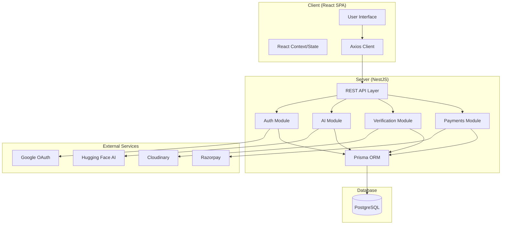
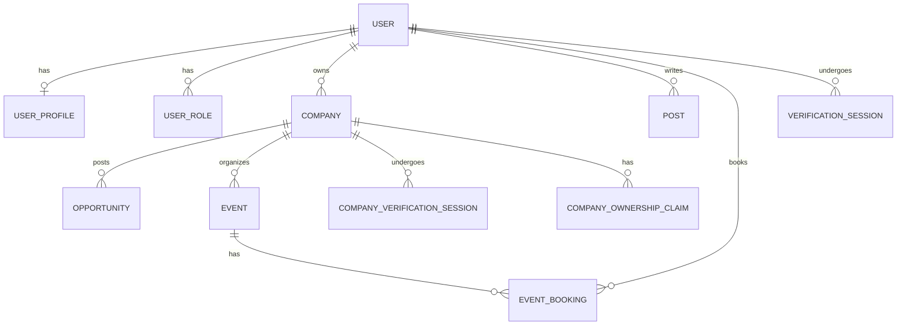

# Team-MARKOV: Technical Documentation

## 1. Project Overview

Team-MARKOV is a next-generation professional networking and trust platform designed to foster verifiable connections between founders, investors, and professionals. Unlike traditional networking sites, MARKOV integrates a robust trust infrastructure, AI-driven optimization, and secure financial workflows to eliminate brokers and ensure transparency.

### Core Value Propositions
- **Identity Trust**: Multi-layered verification for individuals and companies.
- **Secure Deal Rooms**: Broker-free environments for investors and founders.
- **AI-Powered Growth**: Real-time profile analysis and marketing automation.
- **Financial Security**: Escrow-based event bookings and verified funding tracking.

---

## 2. Technology Stack

The platform utilizes a modern, type-safe stack designed for scalability and developer productivity.

### Frontend
- **Framework**: React 19 (Vite)
- **Styling**: Tailwind CSS 4.0
- **UI Components**: Radix UI (Unstyled primitives for accessibility)
- **Icons**: Lucide React
- **State/Data**: Axios (API requests), React Router 7 (Navigation)
- **Language**: TypeScript

### Backend
- **Framework**: NestJS (Modular architecture)
- **Language**: TypeScript
- **ORM**: Prisma (Type-safe database access)
- **Database**: PostgreSQL
- **Real-time**: NestJS EventEmitter

### External Services & Integrations
- **AI**: Hugging Face Inference API (Model: `Qwen2.5-7B-Instruct`)
- **Payments**: Razorpay (Payment gateway and escrow logic)
- **Media**: Cloudinary (Image storage and optimization)
- **OCR**: Tesseract.js (Extracting text from identity documents)
- **Image Processing**: Sharp (Server-side image manipulation)
- **Auth**: Passport.js (JWT, Google OAuth 2.0)

---

## 3. System Architecture

Team-MARKOV follows a **Modular Monolith** architecture on the backend, ensuring that features like AI, Payments, and Verification are isolated yet capable of interacting through well-defined service layers.

### High-Level Architecture Diagram

### Core Module Breakdown
- **AuthModule**: Handles JWT lifecycle, refresh token rotation, and OAuth flows.
- **AiModule**: Interfaces with Hugging Face for professional content generation.
- **VerificationModule**: Manages the complex state machine of identity verification.
- **CompanyModule**: Handles company profiles, roles, and ownership claims.
- **EventModule**: Manages the lifecycle of professional events and escrow payments.

---

## 4. Database Schema

The database is structured to support complex relationships between users, companies, and various trust-related entities.

### Core Entities
- **User**: Central identity with support for multiple roles (Candidate, Company Owner, Admin).
- **Company**: Profiles for businesses, linked to ownership and verification sessions.
- **Event**: Professional gatherings with support for individual or company organizers.
- **Post/Feed**: Social layer for professional updates.

### Trust & Verification Schema
- **VerificationSession**: Tracks the state of personal identity verification (OCR results, face match scores, liveness).
- **CompanyOwnershipClaim**: Manages the multi-method claim process (Domain OTP, Document upload, GST validation).
- **DealRoom**: Secure environment for NDAs and investor-founder communication.

### Schema Relationships (Summary)

---

## 5. API Endpoints Summary

| Category | Endpoint | Method | Description |
| :--- | :--- | :--- | :--- |
| **Auth** | `/auth/register` | `POST` | Create a new user account |
| | `/auth/login` | `POST` | Authenticate and get JWT |
| | `/auth/refresh` | `POST` | Rotate access/refresh tokens |
| | `/auth/google` | `GET` | Initiate Google OAuth flow |
| **Profile**| `/profile/me` | `GET` | Get current user's profile |
| | `/profile/update` | `PUT` | Update professional details |
| **Company**| `/companies` | `POST` | Register a new company |
| | `/companies/:id` | `GET` | Fetch company details |
| | `/ownership-claims` | `POST` | Start a claim process |
| **Events** | `/events` | `GET` | List upcoming events |
| | `/events/book` | `POST` | Register and pay for an event |
| **AI** | `/ai/suggest` | `POST` | Get profile improvement tips |
| | `/ai/campaign` | `POST` | Generate marketing content |
| **Verify** | `/verify/start` | `POST` | Begin identity verification |
| | `/verify/document` | `POST` | Upload ID for OCR analysis |
| | `/verify/face` | `POST` | Submit face capture for matching |

---

## 6. Implementation Details

### Trust Infrastructure & Verification
The platform implements a sophisticated, asynchronous verification pipeline to ensure the highest level of trust.

1. **OCR Extraction**: When a user uploads a document (Passport, Aadhaar, etc.), `Tesseract.js` is used to extract text.
2. **Validation**: The backend validates extracted fields (Name, DOB, ID Number) against user profiles and checks for document expiry.
3. **Face Matching**: A selfie is compared against the ID document photo.
4. **Liveness Detection**: Basic liveness checks are performed to prevent spoofing using static images.
5. **Confidence Scoring**: A final score is calculated; if it falls within a specific range, the session is flagged for **Manual Review**.

### AI Integration (Hugging Face)
The `AiModule` acts as a bridge to the Hugging Face Inference API. 
- **Model**: `Qwen2.5-7B-Instruct` is utilized for its strong reasoning and creative capabilities.
- **Workflow**: Prompts are engineered to return structured JSON, which is then parsed by the `AiService` to provide actionable suggestions for profiles or high-converting marketing copy for companies.

### Escrow & Payments (Razorpay)
Events on MARKOV use an escrow system to protect both organizers and attendees.
- **Booking**: Funds are collected via Razorpay and held by the platform.
- **Release**: Payouts are released to organizers only after the event is successfully completed and no significant fraud reports are filed.
- **Refunds**: Automated refund logic is triggered if an event is cancelled.

---

## 7. Setup & Installation

### Prerequisites
- Node.js >= 20.0.0
- PostgreSQL
- Hugging Face API Token
- Razorpay API Keys
- Cloudinary Credentials

### Backend Setup
1. `cd server`
2. `npm install`
3. Configure `.env` (refer to `.env.example`)
4. `npx prisma migrate dev`
5. `npm run start:dev`

### Frontend Setup
1. `cd client`
2. `npm install`
3. `npm run dev`

---

*Last Updated: April 2026*
